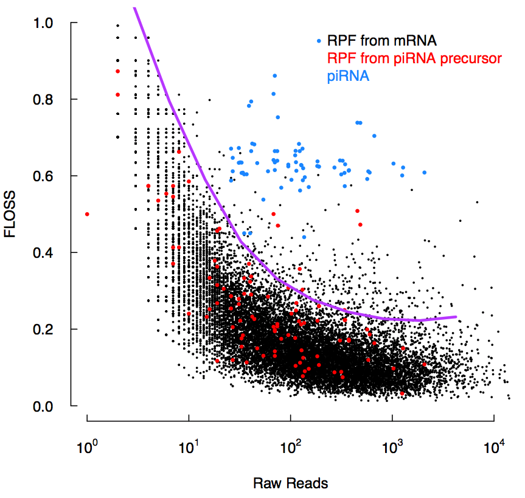

# RiboMining

Mining of Ribo-seq data: Translation efficiency (TE), FLOSS score and Ribosome release score (RRS) calculation

## Translation Efficiency (TE)

Translation efficiency (TE) was first defined by Li et. al in their [Cell paper](https://www.sciencedirect.com/science/article/pii/S0092867414002323)

The rate of protein synthesis per mRNA (TE), as measured by protein synthesis rates (from ribosome profiling) divided by mRNA levels (from mRNA-seq)

The input data (RPF.bed13, RNAseq.bed12) can be acquired after running [PipeRiboseq](https://github.com/sunyumail93/PipeRiboseq) and [PipeRNAseq](https://github.com/sunyumail93/PipeRNAseq) pipelines.

Here we provide one script, `TE_Calculator.sh`, to calculate TE:

```
[Prerequisites]
TE_Calculator.sh            #requires +x premission
bin/
  ├── BED12Extractor.sh     #requires +x premission
  ├── CalculateTE_BH.R
  └── CountBed12_Length.sh  #requires +x premission
data/
  ├── Demo.RNAseq.bed12
  ├── Demo.RPF.bed13
  ├── mm10.ChromInfo.txt
  └── mm10.RefSeq.bed12

[Usage]
TE_Calculator.sh -rpf [RPF.bed13] -g [Transcript.bed12] -rna [RNAseq.bed12] -o [OutputPrefix] -pseudo [Number|Optional, 1 by default]

[Example]
TE_Calculator.sh -rpf data/Demo.RPF.bed13 -g data/mm10.RefSeq.bed12 -rna data/Demo.RNAseq.bed12 -o Demo
```
The result will be a text file with TE scores for each transcript.

## Fragment length organization similarity score (FLOSS)

Fragment length organization similarity score (FLOSS) was first defined by Ingolia et.al in their [Cell Reports paper] (https://www.sciencedirect.com/science/article/pii/S2211124714006299?via%3Dihub)

FLOSS looks at the similarity between a given ribosome footprint (RFP) length distribution and a reference (RFP length distribution on mRNA CDS regions). It measures the magnitude of disagreement between these two distributions, with lower scores reflecting higher similarity.

The input data (RPF.bed13) can be acquired after running [PipeRiboseq](https://github.com/sunyumail93/PipeRiboseq).

```
[Prerequisites]
FLOSS_Distribution.sh               #requires +x premission
FLOSS_DistributionSmRNA.sh          #requires +x premission
FLOSS_Reference.sh                  #requires +x premission
bin/
  └── Shift5endOffset_BED13RPF.py   #requires +x premission
data/
  ├── Demo.RPF.bed13
  ├── Demo.smRNA.bed13
  └── mm10.mRNA.cds.bed12

#This analysis contains the following scripts:
[Usage]
FLOSS_Reference.sh [Data.bed13] [Reference.bed12] [OutputPrefix] [Offset|Optional, default 12]
FLOSS_Distribution.sh [Data.bed13] [Reference.bed12] [OutputPrefix] [Offset|Optional, default 12]
FLOSS_DistributionSmRNA.sh [Data.bed13] [Reference.bed12] [OutputPrefix] [Offset|Optional, default 0]

[Example]
#Step 1: Run FLOSS_Reference.sh to build a reference length distributino from the real data
FLOSS_Reference.sh data/Demo.RPF.bed13 data/mm10.mRNA.cds.bed12 Demo
#Output files:
  Demo.count
  Demo.freq
  
#Step 2: Run FLOSS_Distribution.sh to calculate the Ribo-seq length distribution of each transcript
FLOSS_Distribution.sh data/Demo.RPF.bed13 data/mm10.mRNA.cds.bed12 Demo.FDis
#Output files:
  Demo.FDis.count
  Demo.FDis.freq

#Step 3: Use Floss_Plotting.R to calculate FLOSS based on length distribution results, and plot figures
#Output files:
  FLOSS_Plot.pdf
```



## Ribosome release score (RRS)

Ribosome release score (RRS) was first defined by Guttman et.al in their [Cell paper](https://www.sciencedirect.com/science/article/pii/S0092867413007113)

RRS identifies functional protein-coding transcripts with greater sensitivity by detecting the termination of translation at the end of an ORF.

```
[Prerequisites]
RRS_ConvertRPF2Bam.sh               #requires +x premission
RRS_Calculator.sh                   #requires +x premission
bin/
  ├── BED12Extractor.sh             #requires +x premission
  ├── CalculateRRS_BH.R
  ├── GetRPF5end.sh                 #requires +x premission
  └── Shift5endOffset_BED13RPF.py   #requires +x premission
data/
  ├── Demo.RPF.bed13
  ├── Demo.smRNA.bed13
  └── mm10.mRNA.cds.bed12

[Usage]
RRS_ConvertRPF2Bam.sh [Data.+jxn.bed13.RPF] [Genome|optional, default mm10]
RRS_Calculator.sh -rpf [RPF.bed13.RPF] -g [Transcript.bed12] -rna [RNAseq.unique.bed12|Optional] -o [OutputPrefix] -genome [Genome|Optional, default:mm10]

[Example]
RRS_Calculator.sh -rpf data/Demo.RPF.bed13 -g mm10.mRNA.cds.bed12 -o Demo -genome
```
The result will be a text file with RRS scores for each transcript.
